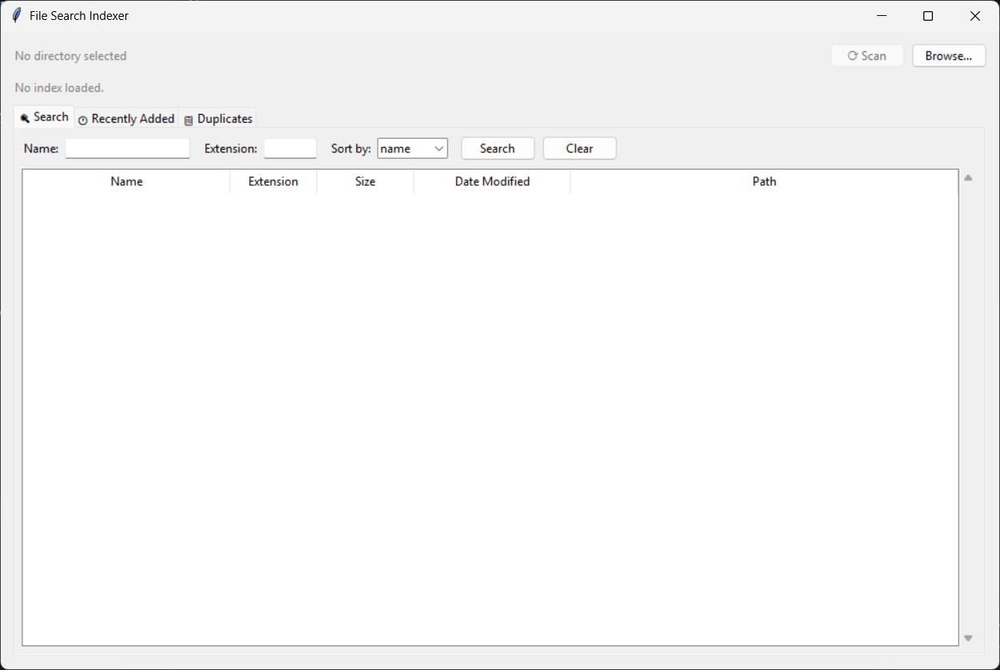

# File Search Indexer

A local file indexing tool that recursively scans directories and provides fast search by name, extension, size, and date. Built with Python, SQLite, and Tkinter.

## Features

- Recursive directory scanner with metadata collection (name, size, extension, date)
- SQLite index for fast search and filtering
- Search by filename keyword or extension
- Filter by file size range
- Sort results by name, size, or date
- Pagination support
- Recently added files view
- Duplicate file finder (same name + same size)
- Full Tkinter GUI with sortable columns
- Graceful handling of inaccessible files and broken symlinks

## Architecture (MVC)

```

File-Search-Indexer/
├── main.py # Entry point
├── model/
│ ├── file_entry.py # FileEntry dataclass
│ ├── scanner.py # FileScanner — recursive os.walk()
│ └── index_db.py # IndexDB — SQLite operations
├── view/
│ └── app_view.py # Tkinter GUI with tabs
├── controller/
│ └── app_controller.py # Bridges View and Model
└── tests/
└── test_index_db.py # Unit tests

```

## Requirements

Python 3.10+ — standard library only (os, sqlite3, pathlib, tkinter, datetime).

## How to run

```bash
python main.py
```

## How to use

1. Click **Browse…** and select a directory to index.
2. Click **⟳ Scan** — all files are recursively scanned and indexed.
3. Use the **Search** tab to filter by name, extension, or sort order.
4. Open the **🕐 Recently Added** tab and click **Refresh** to see the latest files.
5. Open the **📋 Duplicates** tab and click **Find Duplicates** to detect duplicate files.

## Running tests

```bash
python tests\test_index_db.py
```

## Screenshot


